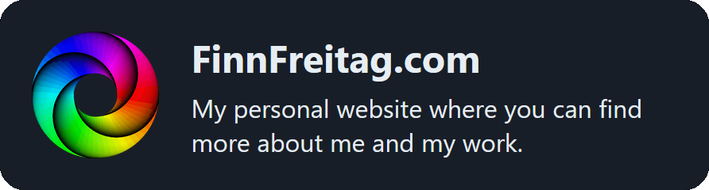
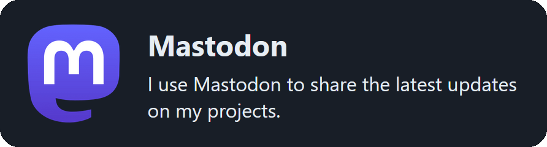
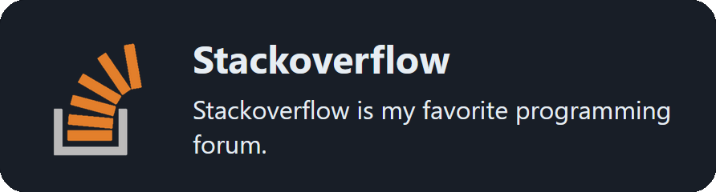
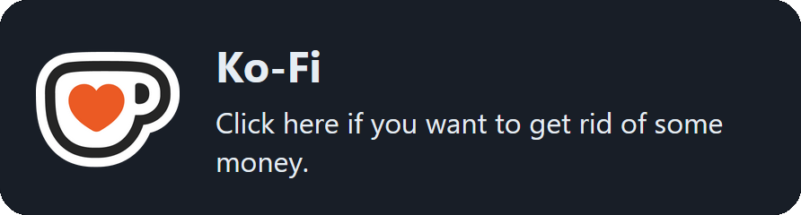

## Hi, I'm Finn, a student from Germany.

## 📖 My Coding Journey
- 2025 – Built mobile apps with React Native
- 2024 – Re-entered web development using React + TypeScript
- 2022 – Learned and used Java at school
- 2020 – Switched to C# from Free Pascal (my main language since)
- 2019 – First hardware projects with Arduino Uno (C++)
- 2018 – Tried web dev (HTML, CSS, JavaScript, PHP), then moved to desktop dev
- 2017 – Started programming with Free Pascal

## 🛠️ Some Skills & Tools
- Languages: C# (main), Java, C++, TypeScript, JavaScript, PHP, Pascal
- Frameworks/Libraries: .NET, React, React Native
- Special Interests: Artificial Intelligence, GIS (QGIS), algorithmic problem solving
- Other Tools: Git, QGIS, Arduino

## Links:

